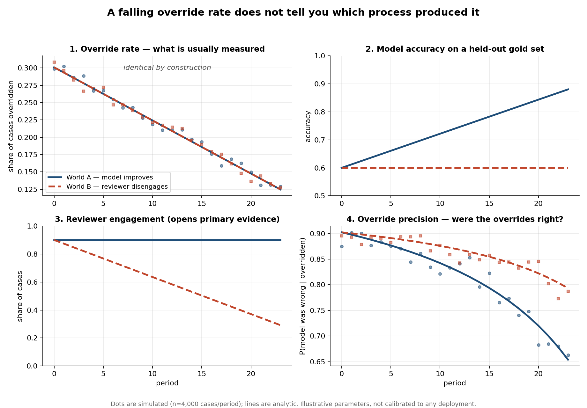

# Simulation: override rate is not identifying

`sim_identification.py` constructs two processes that produce an identical
falling override rate:

- **World A** — the model gets better; the reviewer keeps checking.
- **World B** — the model does not change; the reviewer stops checking.

Engagement in World B is solved analytically so the override-rate paths match
exactly, not approximately. The script then shows which additional observables
separate the two.

Run: `python sim_identification.py` (numpy, matplotlib)

## What separates them

| Observable | Separates? | Cost to collect |
|---|---|---|
| Override rate alone | **No** | free — already logged |
| Model accuracy on a held-out gold set | Yes | requires maintaining a labelled set |
| Whether the reviewer opened the primary record | Yes | requires access logging |
| Precision of the overrides that still occur | Yes, but see below | requires ground truth on overridden cases |

## An unexpected result in panel 4

Override precision falls **further in World A** — the world where oversight is
working. As the model improves, a growing share of the remaining overrides are
the reviewer being wrong rather than the model. In World B the model is still
bad, so the overrides that survive keep catching real errors.

So low override precision is not by itself a warning sign. It has to be read
against model accuracy.

**Status of this result:** the direction depends on the false-alarm rate `F`.
A sweep over `F` to find where the ordering flips has not been run yet. Until
it has, treat panel 4 as suggestive.

## What this is not

This is a demonstration that a naive measure is non-identifying under a stated
generative model. It is not evidence that disengagement occurs in any real
review process, and the parameters are illustrative rather than calibrated.
